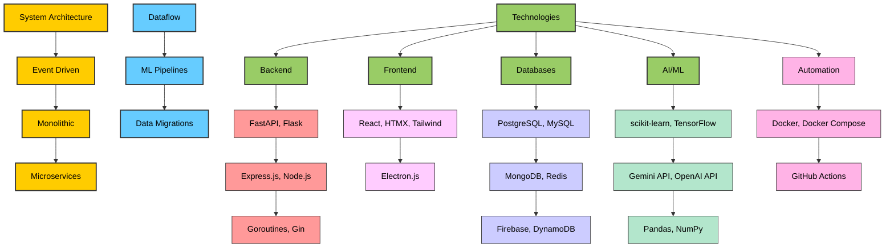

# 👋 Hi, I'm Tawfiq Khalilieh

Welcome to my GitHub profile! I am a software engineer passionate about building scalable systems, ML pipelines, and interactive applications.
This README highlights my **system architecture experience**, **dataflow expertise**, and the **technologies I work with**.

---

## 🛠️ My Tech Landscape

## 📫 How to Reach Me
- LinkedIn: [Tawfiq Khalilieh](https://www.linkedin.com/in/tawfiq-khalilieh/)

## Profile Views:  
